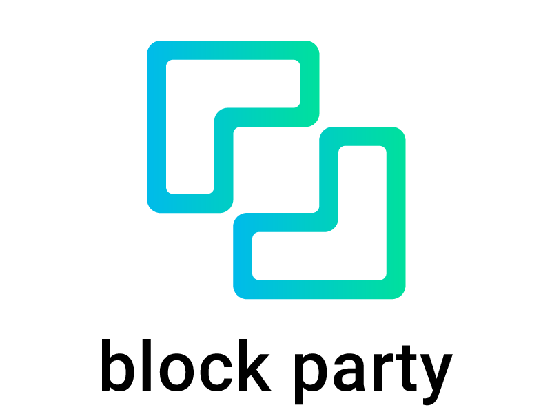

<!-- PROJECT LOGO -->
 

  

  <h3 align="center">Block Party</h3>
  

    <i>Making local policy information accessible and byte-sized</i>
     
     
    A public written record of community board meeting transcript and summary.
     
     
    <a href="https://blockparty.emptybox.io/"><strong>Explore transcripts »</strong></a>
     
     
    <a href="https://medium.com/@sarah_june42/nyc-community-board-meeting-minutes-nlp-civic-tech-8b5d9e4716d9">Medium</a>
    ·
    <a href="https://twitter.com/my_block_party">Twitter</a>
    ·
    <a href="mailto:blockparty.meeting@gmail.com?subject = Feedback&body = Message">Request Feature</a>
  

